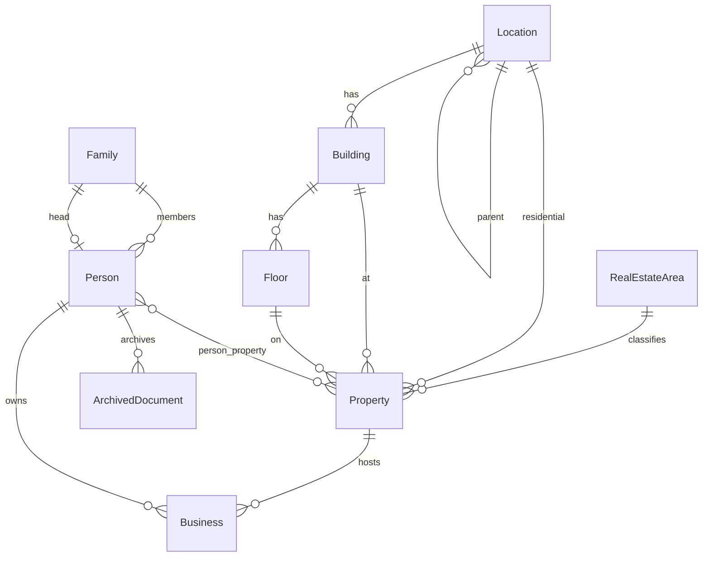

# نظام إدارة معلومات الحي — Neighborhood Information Management System

**English:** Offline, single-admin web application for neighborhood data management.  
**العربية:** تطبيق ويب محلي بمسؤول واحد لإدارة بيانات الحي دون اتصال بالإنترنت.

## Table of contents / جدول المحتويات

- [Overview / نظرة عامة](#overview--نظرة-عامة)
- [Features / الميزات](#features--الميزات)
- [Stack / التقنيات](#stack--التقنيات)
- [Quick start / البدء السريع](#quick-start--البدء-السريع)
- [Documentation / الوثائق](#documentation--الوثائق)
- [Project structure / هيكل المشروع](#project-structure--هيكل-المشروع)
- [Data model / نموذج البيانات](#data-model--نموذج-البيانات)
- [Architecture pointers / نقاط معمارية](#architecture-pointers--نقاط-معمارية)
- [License / الترخيص](#license--الترخيص)

## Overview / نظرة عامة

**English:** This system helps a neighborhood administrator record and maintain structured information about residents, families, real estate, commercial premises, and hierarchical addresses. It supports search and filtering, a statistics dashboard, document archiving (files on disk, paths in the database), and export of official Arabic RTL PDF forms. Everything runs locally with no internet required at runtime.

**العربية:** يساعد النظام مسؤول الحي على تسجيل وإدارة معلومات السكان والعائلات والعقارات والمحال التجارية والعناوين الهرمية. يدعم البحث والفلترة ولوحة إحصائيات وأرشفة المستندات وإخراج نماذج رسمية بصيغة PDF عربية RTL. يعمل بالكامل محلياً دون حاجة للإنترنت أثناء التشغيل.

Requirements: original Arabic brief [req.txt](req.txt); formal specification [SRS_v1.md](SRS_v1.md).

## Features / الميزات

**English:**

- Person records (national ID, name parts, phone, family link)
- Family records (family card number, head of family, members, member count)
- Hierarchical **locations** (منطقة السكن), **buildings**, and **floors** per location
- **Real-estate areas** (المناطق العقارية) as a lookup for properties and statistics
- Properties with residential address (location, building, floor, detail) and legal links to persons (owner / tenant / vacant)
- Commercial businesses linked to properties and owners
- Archived documents per person (filesystem storage, path-only in DB)
- Arabic RTL Filament admin panel with CRUD, filters, and global search
- Dashboard: counts for people, families, businesses, and properties
- CSV export of population by real-estate area from the dashboard
- Official person form as print-ready Arabic PDF (mPDF)

**العربية:**

- سجلات الأشخاص (رقم وطني، اسم، هاتف، ربط بالعائلة)
- سجلات العائلات (رقم بطاقة عائلية، رب الأسرة، الأعضاء، عدد الأفراد)
- **مناطق سكن** هرمية، **مباني** و**طوابق** لكل منطقة
- **مناطق عقارية** مرجعية للعقارات والإحصائيات
- العقارات بعنوان سكن (منطقة، بناء، طابق، تفصيلي) وربط قانوني بالأشخاص (مالك / مستأجر / فروغ)
- المحال التجارية مرتبطة بالعقارات والمالكين
- أرشفة مستندات لكل شخص (ملفات على القرص، المسار فقط في قاعدة البيانات)
- لوحة إدارة Filament عربية RTL مع CRUD وفلاتر وبحث عام
- لوحة معلومات: إحصائيات (سكان، عائلات، محال، عقارات) وتصدير CSV حسب المنطقة العقارية
- نموذج رسمي للشخص كـ PDF عربي جاهز للطباعة

## Stack / التقنيات

**English:**

| Layer | Technology |
|-------|------------|
| Runtime | PHP 8.3+ (8.4 recommended) |
| Framework | Laravel 13 |
| Admin UI | Filament v5.6 (single-admin auth) |
| Database | SQLite (file-based, offline) |
| PDF | mPDF 8.x (Arabic/RTL, no headless browser) |
| Frontend assets | Vite + Tailwind (built to `public/build/`) |
| Fonts (UI & PDF) | itf Qomra Arabic (headings), Cairo (body) |

All JS/CSS and fonts are served locally. No CDN at runtime.

**العربية:**

| الطبقة | التقنية |
|--------|---------|
| التشغيل | PHP 8.3+ (يُفضّل 8.4) |
| الإطار | Laravel 13 |
| واجهة الإدارة | Filament v5.6 (مسؤول واحد) |
| قاعدة البيانات | SQLite (ملف محلي، دون اتصال) |
| PDF | mPDF (عربي/RTL) |
| الأصول الأمامية | Vite + Tailwind (`public/build/`) |
| الخطوط | itf Qomra Arabic (عناوين)، Cairo (نص) |

## Quick start / البدء السريع

**English:**

```bash
composer install
copy .env.example .env   # Windows; use cp on macOS/Linux
php artisan key:generate
php artisan migrate --seed
php artisan serve
```

Open `http://127.0.0.1:8000/admin` — default login: `admin@local.test` / `password` (change after first login).

For full install options, troubleshooting, and offline notes, see [docs/INSTALLATION.md](docs/INSTALLATION.md) and [docs/RUNNING.md](docs/RUNNING.md).

**العربية:**

```bash
composer install
copy .env.example .env   # ويندوز؛ استخدم cp على macOS/Linux
php artisan key:generate
php artisan migrate --seed
php artisan serve
```

افتح `http://127.0.0.1:8000/admin` — الدخول الافتراضي: `admin@local.test` / `password` (غيّر كلمة المرور بعد أول دخول).

لتفاصيل التثبيت والتشغيل راجع [docs/INSTALLATION.md](docs/INSTALLATION.md) و [docs/RUNNING.md](docs/RUNNING.md).

## Documentation / الوثائق

| Guide | English | العربية |
|-------|---------|---------|
| [docs/README.md](docs/README.md) | Documentation index | فهرس الوثائق |
| [docs/INSTALLATION.md](docs/INSTALLATION.md) | Install and configure | التثبيت والإعداد |
| [docs/RUNNING.md](docs/RUNNING.md) | Run locally or offline | التشغيل |
| [docs/USAGE.md](docs/USAGE.md) | Admin panel workflows | دليل الاستخدام |
| [docs/DEVELOPMENT.md](docs/DEVELOPMENT.md) | Tests, PDF fonts, dev setup | التطوير والاختبارات |
| [docs/design/DESIGN.md](docs/design/DESIGN.md) | Brand and UI design tokens | هوية العلامة والتصميم |
| [SRS_v1.md](SRS_v1.md) | Software requirements specification | مواصفات المتطلبات |
| [req.txt](req.txt) | Original Arabic requirements brief | المتطلبات الأصلية بالعربية |

## Project structure / هيكل المشروع

**English:** Main application directories (excluding `vendor/` and generated caches):

```
app/
  Models/                    # Person, Family, Property, Location, Building, Floor,
                             # RealEstateArea, Business, ArchivedDocument
  Support/PropertyRelationType.php  # owner / tenant / vacant labels (Filament + PDF)
  Filament/Resources/        # CRUD per entity; relation managers on Person, Family,
                             # Location (buildings), Building (floors)
  Filament/Widgets/          # NeighborhoodStatsOverview
  Filament/Pages/            # Dashboard (CSV export)
  Services/PdfService.php    # mPDF HTML → PDF bytes
  Providers/Filament/        # AdminPanelProvider (path: /admin)
config/
  pdf.php                    # mPDF and font paths
database/
  migrations/                # Schema
  seeders/                   # Admin user + NeighborhoodSeeder sample data
resources/
  views/pdf/                 # RTL official form (person-form.blade.php)
  css/filament/admin/        # Syrian brand theme (Vite source)
public/
  build/                     # Committed Vite build (Filament theme)
  fonts/                     # Web fonts (Qomra CFF for UI)
storage/app/
  documents/                 # Uploaded archives (runtime)
  mpdf-temp/                 # mPDF font cache (runtime)
scripts/                     # PDF font setup Python scripts
tests/Feature/               # Panel, filters, upload, PDF tests
```

**العربية:** المجلدات الرئيسية للتطبيق (بدون `vendor/` والملفات المؤقتة المولّدة) — انظر الشجرة أعلاه. النماذج في `app/Models`، واجهة الإدارة في `app/Filament`، قوالب PDF في `resources/views/pdf/`، المستندات المرفوعة في `storage/app/documents/`.

## Data model / نموذج البيانات



**English:** `Location` nests via `parent_id` and has `Building` records with `Floor` children. `Property` belongs to `RealEstateArea`, `Location`, `Building`, and `Floor`, and links to `Person` through `person_property` (`relation_type`: owner, tenant, or vacant). `Person` belongs to `Family`, owns `Business` records, and has `ArchivedDocument` files.

**العربية:** `Location` هرمية عبر `parent_id` وتحتوي `Building` و`Floor`. `Property` تنتمي إلى `RealEstateArea` و`Location` و`Building` و`Floor`، وترتبط بـ `Person` عبر `person_property` (الوضع القانوني: مالك / مستأجر / فروغ). `Person` ينتمي إلى `Family` ويملك `Business` و`ArchivedDocument`.

## Architecture pointers / نقاط معمارية

**English:**

- **Models:** `app/Models` — Eloquent relationships and domain attributes.
- **Legal status labels:** `app/Support/PropertyRelationType.php` — shared by Filament pivot UI and PDF.
- **Admin CRUD:** `app/Filament/Resources` — forms, tables, filters, cascading location/building/floor selects.
- **Person relations:** `app/Filament/Resources/People/RelationManagers` — properties (legal status), businesses, documents.
- **Reference data:** `Locations` (with buildings), `Buildings` (with floors), `RealEstateAreas`.
- **Statistics:** `app/Filament/Widgets` + `app/Filament/Pages/Dashboard.php`.
- **PDF export:** `app/Services/PdfService.php` + `resources/views/pdf/` + `config/pdf.php`.
- **Document storage:** `filesystems` disk `documents`; DB stores `file_path` only — see [docs/USAGE.md](docs/USAGE.md).

For tests, PDF font regeneration, and mPDF cache, see [docs/DEVELOPMENT.md](docs/DEVELOPMENT.md).

**العربية:**

- **النماذج:** `app/Models`
- **الوضع القانوني:** `app/Support/PropertyRelationType.php`
- **واجهة الإدارة:** `app/Filament/Resources`
- **علاقات الشخص:** RelationManagers تحت `People/`
- **البيانات المرجعية:** المناطق (مع المباني)، المباني (مع الطوابق)، المناطق العقارية
- **الإحصائيات:** Widgets + Dashboard
- **PDF:** PdfService + قوالب Blade + `config/pdf.php`
- **المستندات:** قرص `documents` — المسار فقط في قاعدة البيانات

للاختبارات وخطوط PDF راجع [docs/DEVELOPMENT.md](docs/DEVELOPMENT.md).

## License / الترخيص

**English:** This project is released under the [MIT License](https://opensource.org/licenses/MIT) (see `composer.json`).

**العربية:** يُوزَّع المشروع تحت [رخصة MIT](https://opensource.org/licenses/MIT) (انظر `composer.json`).
